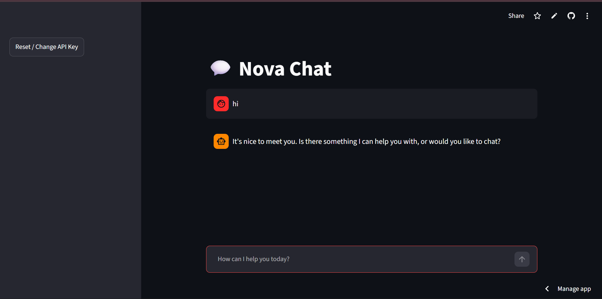
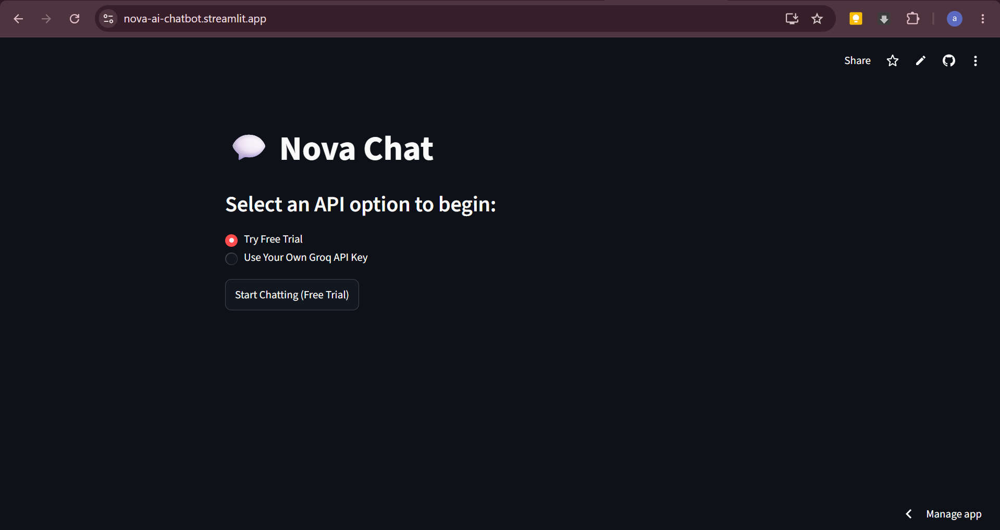
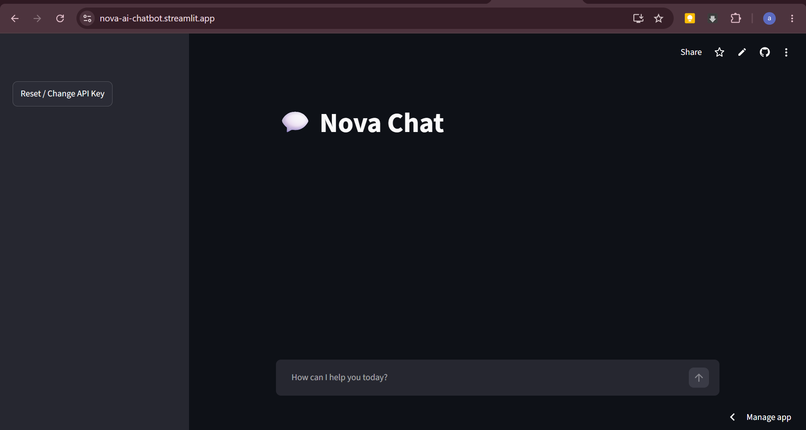

# 💬 Nova Chat

A modern, lightweight, and interactive web-based AI Chatbot built using **Streamlit** and powered by the **Groq API** (using the `llama-3.3-70b-versatile` model). This chatbot supports conversation memory (chat history) and real-time streaming-like user experience.

### 📸 App Preview

| 🔑 API Selection | 💬 Chat Interface | ⚙️ Sidebar Controls |
| :---: | :---: | :---: |
|  |  |  |

---

## 🚀 Live Demo
🌐 **[View Live Demo](https://nova-ai-chatbot.streamlit.app/)** 

---

## ✨ Features
* 🧠 **Conversation Memory:** Remembers past messages in the current session so you can have back-and-forth conversations.
* ⚡ **Fast & Responsive:** Utilizes Groq for lightning-fast response generation.
* 🎨 **Clean UI:** Built with Streamlit's native chat elements for a clean and responsive messaging interface.
* 🛡️ **Robust Error Handling:** Detects API rate limits (HTTP 429) and displays clear instructions for the user.
* 🔑 **Authentication Flexibility:** Allows using a default backend key or inputting your own key securely from the app interface.

---

## 🛠️ Tech Stack
* **Framework:** [Streamlit](https://streamlit.io/)
* **AI Model:** [Groq API](https://console.groq.com/) (`llama-3.3-70b-versatile`)
* **Environment Management:** `python-dotenv`

---

## ⚙️ Installation & Setup

Follow these steps to run the project locally on your machine:

### 1. Clone or Open the Directory
Navigate to your project folder:
```bash
cd AI_Chatbot
```

### 2. Set Up a Virtual Environment (Optional but Recommended)
Create and activate a virtual environment to manage dependencies:

* **Windows:**
  ```powershell
  python -m venv venv
  .\venv\Scripts\activate
  ```
* **Mac/Linux:**
  ```bash
  python3 -m venv venv
  source venv/bin/activate
  ```

### 3. Install Dependencies
Install all the required python packages:
```bash
pip install -r requirements.txt
```

### 4. Configure Environment Variables
Create a `.env` file in the root directory (already done for this project) and add your Groq API key:
```env
GROQ_API_KEY=your_actual_api_key_here
```
> ⚠️ **Important:** Do not commit your `.env` file containing your API key to public repositories. Make sure it is added to your `.gitignore`.

### 5. Run the Chatbot
Start the Streamlit development server:
```bash
streamlit run app.py
```

Streamlit will launch a local development server and open the app in your default web browser (typically at `http://localhost:8501`).

---

## 📄 License
This project is open-source and available under the [MIT License](LICENSE).
